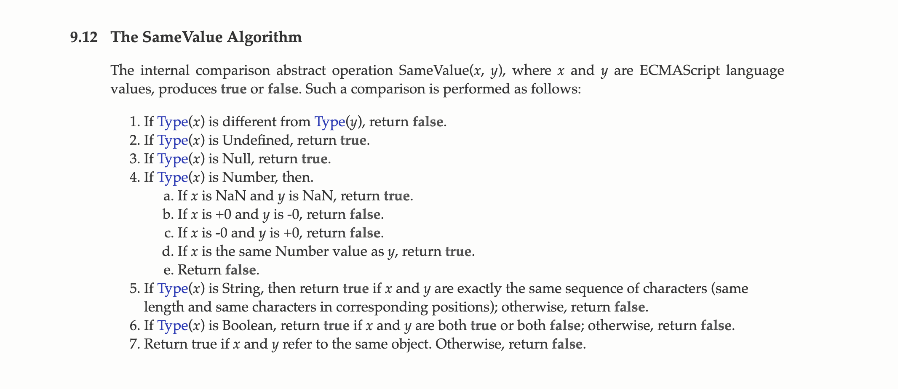
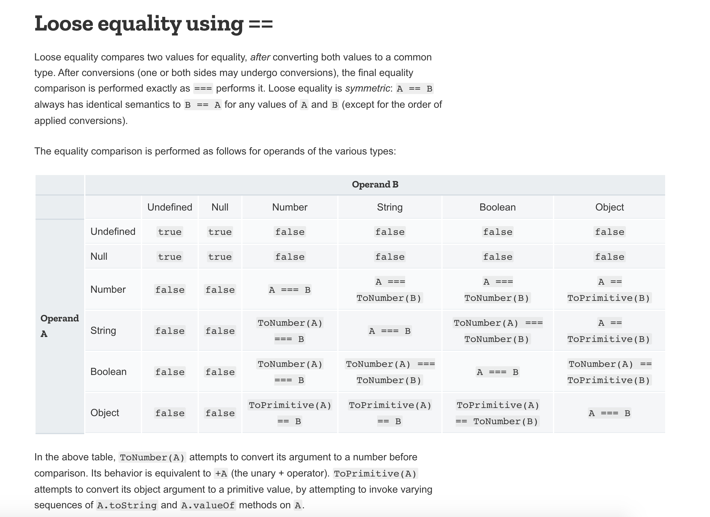

## Equality


JavaScript provides three different value-comparison operations:
* **==** Abstract Equality Comparison ("loose equality", "double equals")
* **===** Strict Equality Comparison ("strict equality", "identity", "triple equals")
* **Object.is** provides SameValue (new in ES2015).

---

### Data types

|         |          |
| ------------- |-------------|
| Primitive     | number, string, boolean, undefined, null, bigInt, symbol |
| Non-primitive | object, arrray, function |

---

### Coercion
Process of converting value from one type to another

#### String

> Explicit string conversion

|         |          |
| ------------- |-------------|
| String("hello")  | "hello"   |
| String(null)  | "null"      |
| String(undefined)  | "undefined"   |
| String(true)  | "true"     |
| String(false)  | "false"   |
| String(12.345)  | "12.345"  |
| String(0)  | "0"      |
| String(-0)  | "0"         |
| String(Infinity)  | "Infinity" |
| String(-Infinity)  | "-Infinity"  |


> Implicit string conversion

|         |          |
| ------------- |-------------|
| "" + "hello"  | "hello"   |
| "" + null  | "null"      |
| "" + undefined  | "undefined"   |
| "" + true  | "true"     |
| "" + false  | "false"   |
| "" + 12.34  | "12.34"  |
| "" + 0  | "0"      |
| "" + -0  | "0"         |
| "" + Infinity  | "Infinity" |
| "" + -Infinity  | "-Infinity"  |


```
console.log(10 + "10" + 10 + 10);
```


#### Number

> Explicit number conversion

|         |          |
| ------------- |-------------|
| Number(1234)  | 1234   |
| Number(null)  | 0   |
| Number(undefined)  | NaN   |
| Number(true)  | 1   |
| Number(false)  | 0   |
| Number(12.34)  | 12.34   |
| Number("hello")  | NaN   |
| Number("0")  | 0   |
| Number(-0)  | -0   |
| Number(Infinity)  | Infinity   |
| Number(-Infinity)  | -Infinity   |


> Implicit number conversion

|         |          |
| ------------- |-------------|
| +1234  | 1234   |
| +null  | 0   |
| +undefined  | NaN   |
| +true  | 1   |
| +false  | 0   |
| +12.34  | 12.34   |
| +"hello"  | NaN   |
| +"0"  | 0   |
| +(-0)  | -0   |
| +Infinity  | Infinity   |
| +(-Infinity)  | -Infinity   |


#### Boolean

**Falsy values** -  "", null, undefined, 0, -0, false, NaN

> Explicit boolean conversion

|         |          |
| ------------- |-------------|
| Boolean("")  | false   |
| Boolean(null)  | false   |
| Boolean(undefined)  | false   |
| Boolean(0)  | false   |
| Boolean(-0)  | false   |
| Boolean(false)  | false   |
| Boolean(NaN)  | false   |

Apart from falsy values, rest everything is true

|         |          |
| ------------- |-------------|
| Boolean(Infinity)  | true   |
| Boolean(function(){})  | true   |
| Boolean([0])  | true   |
| Boolean({})  | true   |


> Implicit boolean conversion

**First way:**

```
if(condition){} - Implicit coerce to boolean
```

```
if(condition){
    console.log('Truthy');
}else{
    console.log('Falsy');
}
```

**Second way:**

**!** - it will give true for all falsy value

```
!undefined  // true
!NaN        // true
!-0         // true
```

*Examples*

```
var friends = ['Mike', 'Tom', 'Ross'];

while(friends.length){   // friends.length > 0
    console.log(friends.pop());
}
```

```
console.log(Boolean(new Boolean(false))); 
```

```
console.log(1 < 2 < 3);
console.log(3 > 2 > 1);
```

---

### NaN (Not a number or invalid number)

```
console.log(NaN);
console.log(NaN + 1);
console.log("ten" - 5);
console.log("sunny"/"bar");
console.log(undefined + 1);
```

```
console.log(NaN == NaN);
console.log(NaN == null);
console.log(NaN == 0);
console.log(NaN == undefined);
```

**isNaN** converts the argument to a Number and returns true if the resulting value is NaN.

```
console.log(isNaN(NaN));
console.log(isNaN("hello"));
console.log(isNaN(undefined + 1));

console.log(isNaN("5"));
console.log(isNaN(12));
console.log(isNaN(10/0));
```


**Number.isNaN** does not convert the argument; it returns true when the argument is a Number and is NaN.


```
console.log(Number.isNaN(NaN));
console.log(Number.isNaN("hello"));
console.log(Number.isNaN(undefined + 1));

console.log(Number.isNaN("5"));
console.log(Number.isNaN(12));
console.log(Number.isNaN(10/0));
```

```
console.log(Number.isNaN(Number("hello")));
console.log(Number.isNaN("foo"/"bar"));
```

```
console.log("b" + "a" + +"a" + "a");
```

---

### Object.is

The Object.is() method determines whether two values are the same value.

```
console.log(NaN == NaN);

console.log(0 == -0);
console.log(true == 1);
console.log(5 == "5");
console.log(undefined == null);

console.log(0 === -0);
```

```
console.log(Object.is(NaN, NaN));

console.log(Object.is(0, -0));
console.log(Object.is(true, 1));
console.log(Object.is(5, "5"));
console.log(Object.is(undefined, null));
```



---

### Equality Comparison chart




#### Quizzes

```
console.log(undefined == undefined);
console.log(null == null);
console.log(undefined == null);
console.log(5 == "5");
console.log(1 == true);
console.log(0 == false);
console.log("false" == false);
console.log("0" == false);
console.log(true == 5);

console.log(0 == false);
console.log("" == false);
console.log(!!"true" == !!"false")
console.log(null == false);
console.log(!"null" == false);
```

---

### toString()

**String** - returns the value of a String object

```
var name = "Sunny";
name.toString();        // "Sunny"
```

**Number** - convert a number to a string

```
var x = 10;
x.toString();           // "10"
```

**Boolean** - convert a boolean to a string

```
var x = true;
x.toString();           // "true"
```

**Array** - converts every element into string and join with ,

```
var a = [1,2,3];
a.toString();           // "1,2,3"
```

**Date** - returns human readable format of date and time

```
var a = new Date();
a.toString();           // "Sat Jun 20 2020 15:35:34 GMT+0530 (India Standard Time)"
```

**Function** - returns function definition in form of string

```
var a = function(){};
a.toString();           // "function(){}"
```

**Object** - Always returns [object Object]

```
var a = {x: 10};
a.toString();           // "[object Object]"
```

**Regular expression** - toString returns same value as regex pattern

```
var pattern = /^\d{1,5}$/;
pattern.toString();     // "/^\d{1,5}$/"
```

---
